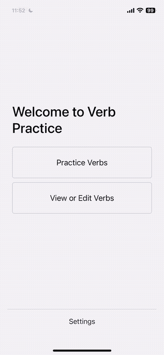

# Verb Practice App

This is a simple Spanish verb conjugation quizzing app built with Expo/React Native. Its original purpose was twofold:

1. Teach myself the basics of React Native
2. Practice my spanish verb conjugations, once the app is published!



## Development quickstart

1. Install dependencies

   ```bash
   npm install
   ```

2. Start the app

   ```bash
    npx expo start
   ```

In the output, you'll find options to open the app in a

- [development build](https://docs.expo.dev/develop/development-builds/introduction/)
- [Android emulator](https://docs.expo.dev/workflow/android-studio-emulator/)
- [iOS simulator](https://docs.expo.dev/workflow/ios-simulator/)
- [Expo Go](https://expo.dev/go), a limited sandbox for trying out app development with Expo

You can start developing by editing the files inside the **app** directory. This project uses [file-based routing](https://docs.expo.dev/router/introduction).

## Install the App

As of now, the app is not published on the Apple App Store or Google Play.

If you are on an Android device, you can build the app and install manually.

### Why it's not published

**Google Play:**
I don't own an Android device yet. I'm delaying submitting the app until I have one, as Google Play charges a one-time $25 fee for a developer account in order to submit an app.

**Apple App Store (rant warning):**
Apple charges a yearly $100 subscription fee for a developer account, which is required for development and publishing of apps. If you only pay for a year to initially submit your app and then don't pay the following year, they delete your app from the app store. Apple has made the development and testing process unnecessarily restrictive, which left a VERY sour taste in my mouth.

I don't own a Mac computer, so during the development and testing, I was using a combination of the iOS Expo Go (dev) app and Android Simulator. For the uninformed, you cannot build iOS apps (including React Native or Flutter) on non-apple operating systems. I knew that going into this project. However, I incorrectly assumed that I'd able to utilize Expo's EAS build services (or a macOS VM) to create an iOS build, and install this on my device for testing and development. This is not possible without that $100/year developer account.

Look -- I paid nearly $1000 to own an iPhone. But, unless I fork over another $100 every year, I am forbidden from running MY OWN code on it! It really got me questioning whether or not I actually "own" this device, given that it (via Apple) is exerting power over me - the owner and developer. It reminds me of a news article I recently read, about how BMW manufacters all their vehicles with heated seats. The models that "don't have" heated seats actually DO have the necessary hardware installed, the seat heater function is just disabled. But -- they'll happily let you enable the seat heaters that YOU OWN -- for a monthly subscription fee! Gross!

No, Apple. I am done playing ball in your court. The experience has left me feeling frustrated and violated. In the United States, since consumer protections are a joke, Apple is allowed to run free and abuse their power and I'm tired of it. There are stories all over the news about how they are abusive, from denying their competition to publish apps, to taking an indulgent 30% fee on all in-app transactions. They are an evil profit-seeking company in my eyes, and they do not deserve my attention any longer. Until I make the switch back to an Android mobile device, I am not planning to tinker any more with mobile app development. Which is unfortunate, because I actually really enjoyed building this little verb app and would like to work on some more substantial projects.
